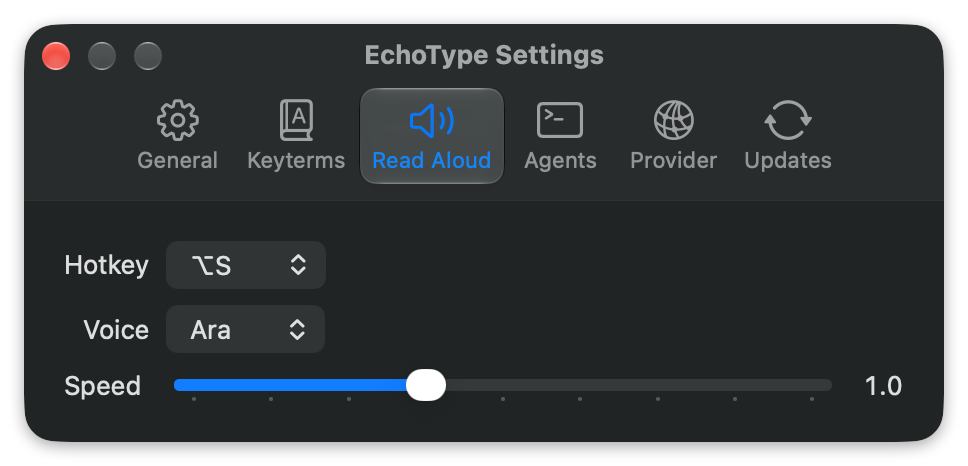
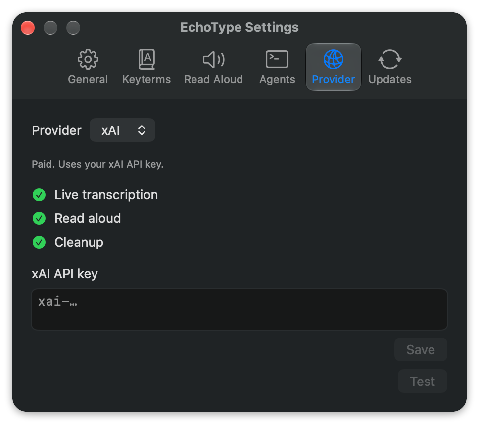
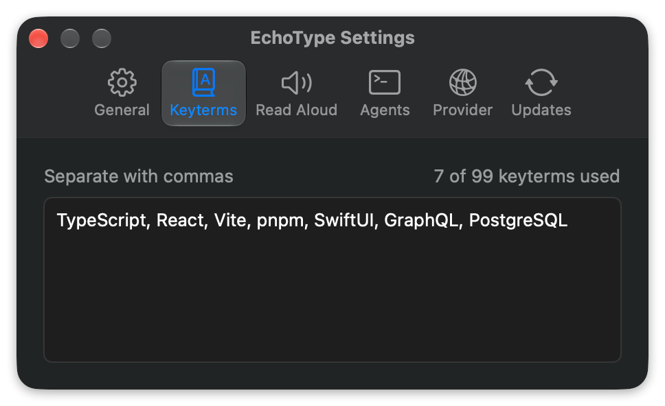

<p align="center">
  
</p>

<h1 align="center">EchoType</h1>

<p align="center">
  Dictation and read aloud for macOS, powered by xAI or on-device by Apple.
</p>

EchoType lives in the menu bar. Press a hotkey in any app and start talking. Your words
stream into a small overlay as you speak, and the text is pasted where your cursor was
when you stop. Select some text and press a second hotkey to hear it read back.

<p align="center">
  
</p>

## Features

- **Dictate anywhere.** Press <kbd>⌥</kbd><kbd>D</kbd> to start and again to insert the
  text into the focused app. <kbd>Esc</kbd> discards it.
- **Live transcript.** An overlay beside the focused window shows words as they arrive,
  along with the microphone in use and the elapsed time.
- **Clean up text.** Sentences split by pauses are joined and phrases you take back are
  dropped while you talk. Cleanup runs whenever the selected provider supports it. Your
  words are never swapped for different ones.
- **Keyterms.** Add names and bits of jargon so they're spelled correctly. The selected
  provider sets the limit, currently 99 saved terms with either provider.
- **Read aloud.** Select text and press <kbd>⌥</kbd><kbd>S</kbd> to hear it. <kbd>Space</kbd>
  pauses. Voice and speed are remembered for each provider.
- **Provider.** Choose a provider in Settings, see its supported features and manage its
  API key. Both supply transcription, read aloud and cleanup. xAI is the default and needs
  an API key. Apple is free and keeps audio and text on your Mac; Settings shows anything
  it still needs, such as a speech model download, a voice or Apple Intelligence.
- **Last Dictation.** Shows how your last dictation was cleaned up, request by request,
  and copies it as JSON.
- **Stays out of the way.** No Dock icon, an optional launch at login, and a menu bar
  toggle to turn the hotkeys off. Your API key is kept in the Keychain.

<p align="center">
  
</p>
<p align="center">
  
</p>
<p align="center">
  
</p>

## Install

You need macOS 26 or later, and an [xAI API key](https://console.x.ai) unless you choose
Apple.

1. Download the latest `EchoType-<version>.dmg` from
   [Releases](https://github.com/AidanZealley/echotype/releases/latest).
2. Open the DMG and drag EchoType into Applications.
3. Launch EchoType. The release isn't notarized yet, so macOS may block the first launch.
   If it does, open **System Settings → Privacy & Security** and choose **Open Anyway**.
4. Allow **Device Control and Data Access** (Accessibility on older versions of macOS)
   when asked. EchoType needs it for the hotkeys and to paste text.
5. Click the waveform icon in the menu bar, choose **Settings…**, and paste your key into
   the **Provider** tab with xAI selected. **Save** keeps it in the Keychain. Or select
   Apple, which needs no key. **Test** records five seconds and shows what it heard.
6. Press <kbd>⌥</kbd><kbd>D</kbd> in any text field and start talking. macOS asks for
   microphone access the first time.

If another app already uses <kbd>⌥</kbd><kbd>D</kbd> or <kbd>⌥</kbd><kbd>S</kbd>, switch
to the <kbd>⌃</kbd><kbd>⌥</kbd> version in Settings.

### Updating

**Settings → Updates** shows your version and links to the latest release. To update,
quit EchoType, download the new DMG, drag EchoType into Applications and choose
**Replace**.

## Voice replies

End a dictation with "reply with EchoType" and it sends itself. The agent calls the EchoType MCP's `speak`
tool to read a version of its reply aloud, then writes the full reply as usual. Register the
server once in each agent: open **Settings → Agents**, copy the command for Claude Code or Codex,
run it in a terminal, and start a new agent session. EchoType has to be running for `speak` to
work. The Agents tab also has optional instructions you can copy into your agent's instruction
file to make spoken replies more reliable without shortening written answers.

## Development

You need macOS 26, Xcode with Swift 6.2, and an Apple Development signing certificate in
your keychain. EchoType has to run as a signed app bundle so macOS can keep its
microphone and accessibility permissions between builds.

```sh
./scripts/run.sh              # build, sign and launch .build/EchoType.app
./scripts/run.sh --hud-demo   # loop the overlay through its states, no mic or key needed
XAI_API_KEY= ECHOTYPE_FIXTURE_WAV= swift test --enable-code-coverage
                              # deterministic core and app-adapter tests, no app launch
./scripts/install.sh          # build a release and replace /Applications/EchoType.app
```

`run.sh` and `install.sh` quit any running copy of EchoType before launching the new
build. If you have more than one Apple Development certificate, set
`ECHOTYPE_SIGNING_IDENTITY` to the one to use. `security find-identity -v -p codesigning`
lists them.

Deterministic tests and `swift build -c release --product EchoTypeApp` need no signing
certificate. App tests import the executable target without running its entry point.
The `macOS tests and release build` Actions job defines these checks on macOS 26
with Xcode 26.6. Making it a required merge check needs a separate repository setting.

Integration tests that call xAI are skipped unless `XAI_API_KEY` is set. The live
protocol test also needs `ECHOTYPE_FIXTURE_WAV` pointing at a recording; see
`Tests/EchoTypeCoreTests/Integration/LiveProtocolTests.swift`. Checks that run Apple's
frameworks are skipped unless `ECHOTYPE_APPLE_LIVE=1` is set.

To measure transcription readiness in a fresh test process with English speech assets
already installed, run:

```bash
ECHOTYPE_APPLE_LIVE=1 swift test --disable-xctest --filter installedTranscriberStartsWithinFiveSeconds
```

This checks the adapter's five-second readiness target, not the complete signed-app launch.
The Apple live suites also cover silent sessions, reading pause/resume and cancellation,
and synthesis with a missing saved voice using an installed fallback. For recorded speech,
set `ECHOTYPE_FIXTURE_WAV` to a 16-bit PCM WAV. The research's synthetic fixture additionally
checks pause/resume and the final transcript tail; its observed jargon errors are recorded
in the [verification plan](docs/apple-on-device-provider/implementation/plan.md#automated-evidence).

The code is split into `EchoTypeCore`, which holds the session, protocol and settings
logic and is covered by tests, and `EchoTypeApp`, the AppKit and SwiftUI shell around it.
[`docs/decisions`](docs/decisions/README.md) records why things work the way they do, and
[`docs/releasing.md`](docs/releasing.md) covers packaging a DMG for release.

To add a provider, create `Sources/EchoTypeCore/Providers/<Name>/` with its description
and service adapters, give it a readiness check if a Mac's setup can rule its services
out, add it to `Providers.all`, and add fixture tests. Settings and operation wiring use
the registry. The [provider adapter decision](docs/decisions/0025-provider-adapters.md)
sets out the contracts and required defaults.
