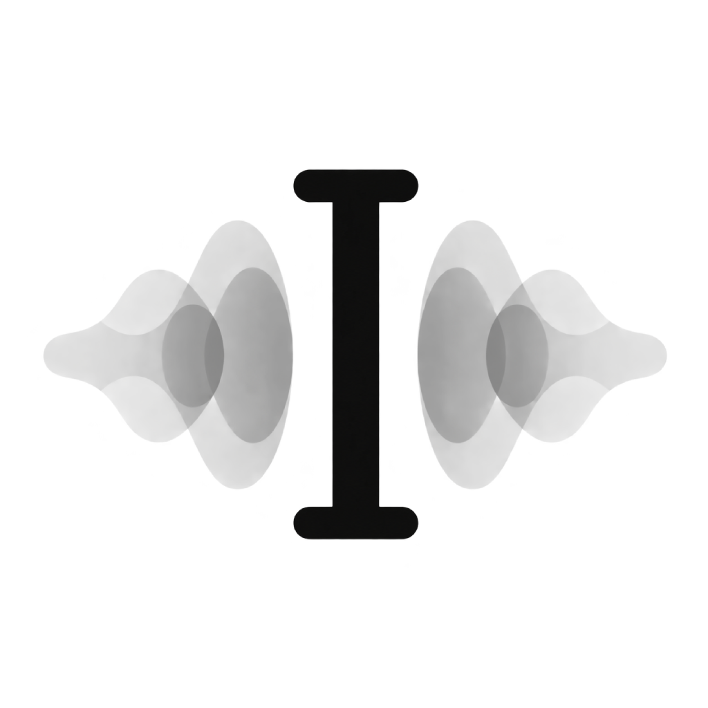
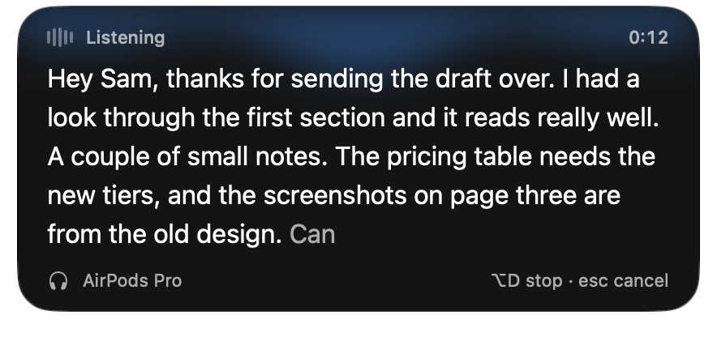
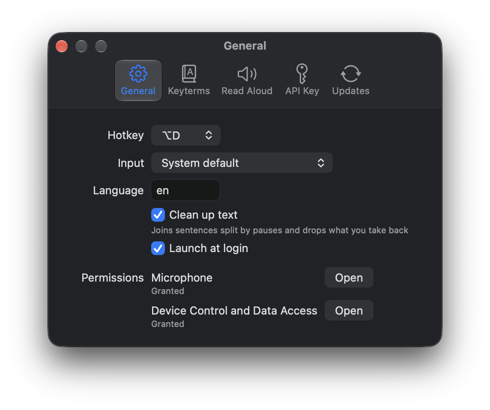
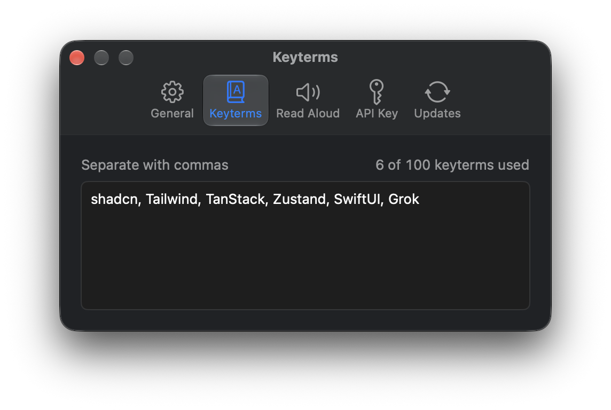
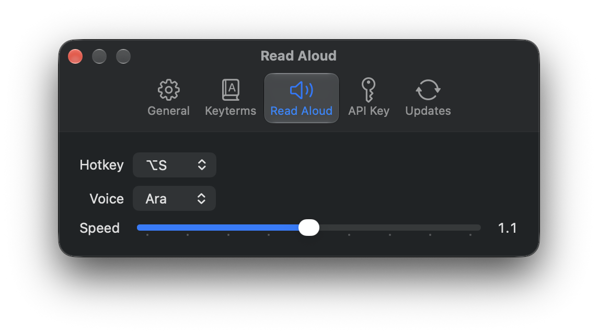

<p align="center">
  
</p>

<h1 align="center">EchoType</h1>

<p align="center">
  Dictation and read aloud for macOS, powered by xAI.
</p>

EchoType lives in the menu bar. Press a hotkey in any app and start talking. Your words
stream into a small overlay as you speak, and the text is pasted where your cursor was
when you stop. Select some text and press a second hotkey to hear it read back.

<p align="center">
  
</p>

## Features

- **Dictate anywhere.** Press <kbd>⌥</kbd><kbd>D</kbd> to start and again to insert the
  text into the focused app. <kbd>Esc</kbd> discards it.
- **Live transcript.** An overlay beside the focused window shows words as they arrive,
  along with the microphone in use and the elapsed time.
- **Clean up text.** Sentences split by pauses are joined and phrases you take back are
  dropped while you talk. Your words are never swapped for different ones.
- **Keyterms.** Add up to 100 names and bits of jargon so they're spelled correctly.
- **Read aloud.** Select text and press <kbd>⌥</kbd><kbd>S</kbd> to hear it. <kbd>Space</kbd>
  pauses, and you can choose the voice and speed.
- **Last Dictation.** **Last Dictation…** in the menu bar shows how your last dictation
  was cleaned up, request by request, and copies it as JSON.
- **Stays out of the way.** No Dock icon, an optional launch at login, and a menu bar
  toggle to turn the hotkeys off. Your API key is kept in the Keychain.

<p align="center">
  
  
  
</p>

## Install

You need macOS 26 or later and an [xAI API key](https://console.x.ai).

1. Download the latest `EchoType-<version>.dmg` from
   [Releases](https://github.com/AidanZealley/echotype/releases/latest).
2. Open the DMG and drag EchoType into Applications.
3. Launch EchoType. The release isn't notarized yet, so macOS may block the first launch.
   If it does, open **System Settings → Privacy & Security** and choose **Open Anyway**.
4. Allow **Device Control and Data Access** (Accessibility on older versions of macOS)
   when asked. EchoType needs it for the hotkeys and to paste text.
5. Click the waveform icon in the menu bar, choose **Settings…**, and paste your key into
   the **API Key** tab. **Test** records five seconds and shows what it heard.
6. Press <kbd>⌥</kbd><kbd>D</kbd> in any text field and start talking. macOS asks for
   microphone access the first time.

If another app already uses <kbd>⌥</kbd><kbd>D</kbd> or <kbd>⌥</kbd><kbd>S</kbd>, switch
to the <kbd>⌃</kbd><kbd>⌥</kbd> version in Settings.

### Updating

**Settings → Updates** shows your version and links to the latest release. To update,
quit EchoType, download the new DMG, drag EchoType into Applications and choose
**Replace**.

## Voice replies

End a dictation with "reply with EchoType" and it sends itself. The agent calls EchoType's `speak`
tool to read a version of its reply aloud, then writes the full reply as usual. Register the
server once in each agent: open **Settings → Agents**, copy the command for Claude Code or Codex,
run it in a terminal, and start a new agent session. EchoType has to be running for `speak` to
work. The Agents tab also has optional instructions you can copy into your agent's instruction
file to make spoken replies more reliable without shortening written answers.

T3 Code needs no step of its own. It runs Claude Code and Codex, which use the server themselves.

## Development

You need macOS 26, Xcode with Swift 6.2, and an Apple Development signing certificate in
your keychain. EchoType has to run as a signed app bundle so macOS can keep its
microphone and accessibility permissions between builds.

```sh
./scripts/run.sh              # build, sign and launch .build/EchoType.app
./scripts/run.sh --hud-demo   # loop the overlay through its states, no mic or key needed
swift test                    # run the core tests
./scripts/install.sh          # build a release and replace /Applications/EchoType.app
```

`run.sh` and `install.sh` quit any running copy of EchoType before launching the new
build. If you have more than one Apple Development certificate, set
`ECHOTYPE_SIGNING_IDENTITY` to the one to use. `security find-identity -v -p codesigning`
lists them.

Integration tests that call xAI are skipped unless `XAI_API_KEY` is set. The live
protocol test also needs `ECHOTYPE_FIXTURE_WAV` pointing at a recording; see
`Tests/EchoTypeCoreTests/Integration/LiveProtocolTests.swift`.

The code is split into `EchoTypeCore`, which holds the session, protocol and settings
logic and is covered by tests, and `EchoTypeApp`, the AppKit and SwiftUI shell around it.
[`docs/decisions`](docs/decisions/README.md) records why things work the way they do, and
[`docs/releasing.md`](docs/releasing.md) covers packaging a DMG for release.
